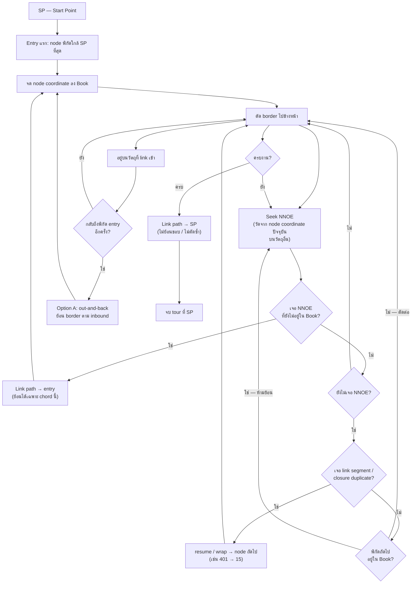

# Auto Link — draft logic (WIP)

**Status:** Draft spec — **sandbox implementation** in `linkerAutoLinkNnoe.ts` (legacy graph engine unchanged in `linkerAutoLink.ts`).  
**Author:** User draft, captured June 2026.  
**Related:** [BK_LINKER_SPEC.md](./BK_LINKER_SPEC.md) · Vector Linker Sandbox (`/vector-linker-sandbox`)

---

## Purpose

Define how **Auto Link** should choose link chords and border traversal order without manual node numbers. This document records the **first draft** and a **flow chart** for later refinement.

---

## Terms

| Term | Meaning |
|------|---------|
| **SP** | Start Point — machine start (NC7 default G90 **X0 Y20**) |
| **NNOE** | Nearest Node Of (another) Object Else — on **another** object, the border node whose **(X,Y) coordinate** is closest to your **current node coordinate** (not loop start/end) |
| **The Book** | Running log of **node coordinates** the wire has already cut along border — no backward cut on coords already in the Book |
| **Entry (link path)** | Through-foam link into another object at NNOE — backward on **chord** allowed |
| **Exit (out-and-back)** | After return to entry on an object visit — retrace **inbound border** backward (Option A) |
| **Right way** | Default **right direction** along border (forward seek); user can **reverse per segment later** (`<` / `>`) |
| **Link path** | Through-foam chord between two border nodes (green link in UI) — **only allowed non-forward “walk”** besides entry |
| **Another object** | Any contour/object whose node coordinate is **not** the same object you are currently cutting on |
| **NNOE tie-break** | If equal distance to current node → **pick at random** |

---

## User draft (original rules)

1. **Ignore all loop starts and ends** — do not use loop M / closure duplicates as link endpoints.
2. **Start at SP → NNOE** — from Start Point, go to the nearest node on any object.
3. **Cut right way until another NNOE** — follow border path in default direction until meeting an NNOE on another object.
4. **Make link path into that object** — create a link chord from current node to that NNOE.
5. **Cut along right direction until meet NNOE again** — on the new object, continue border until the next NNOE.
6. **If there is no NNOE** — keep cutting until hitting a link segment, then continue forward to the next node (loop wrap / resume, not backward).
7. **Do not cut previous nodes that have already been cut** — no revisiting visited nodes as targets or re-tracing cut border.
8. **Repeat for every loop until wire cuts back to start point** — full tour closes back to SP.

---

## Polish pass 1 — NNOE & “another object” (user)

> คิดง่าย ๆ เหมือนมี **สมุด (Book)** ของตัวเองตอน Auto Link เริ่ม

### NNOE วัดจาก node coordinate

- วัดระยะจาก **พิกัด (X,Y) ของ node ที่ยืนอยู่ตอนนี้** ไปหา **พิกัด node บนวัตถุอื่น**
- รอบแรกจาก SP: ยังใช้ node ที่ **พิกัดใกล้ SP ที่สุด** เป็น entry แรก
- หลังเข้าลูปแล้ว ทุกครั้งที่ seek NNOE ใช้ **node coordinate ปัจจุบัน** เป็นจุดอ้างอิง

### “วัตถุอื่น” + สมุด Book

1. Auto Link เริ่ม → wire ตัด → **จดพิกัด node ที่ผ่านลง Book** ไปเรื่อย ๆ  
2. ระหว่างตัด **มองหา NNOE ตลอด** — node บน **วัตถุอื่น** ที่ **พิกัดใกล้คุณที่สุด** (จาก node ปัจจุบัน)  
3. เจอแล้ว → **link path** เข้าไปที่ NNOE นั้นเป็น **entry**  
4. อยู่บนวัตถุนั้น → ตัด **ไปข้างหน้า** → จน **กลับมาที่ entry (พิกัดเดิมที่เข้า)** → **ออกทางที่เข้ามา** (ดู Polish pass 2 — **A: out-and-back บน border**)  
5. **ห้ามตัดย้อน** เพื่อ **สำรวจ/หา NNOE ใหม่** ไปพิกัดที่อยู่ใน Book แล้ว — **ยกเว้น** link path (entry) และ **out-and-back ออกจากวัตถุ** (Polish pass 2)  
6. **ย้อนหลังได้** ที่ (1) **link path (entry)** และ (2) **out-and-back ออก** หลังกลับถึง entry  
7. ตัดไปข้างหน้า + seek NNOE เรื่อย ๆ จน **forward กลับมาที่ SP** อีกครั้ง  

### English summary (same rules)

- Treat Auto Link like keeping a **book** of every **node coordinate** passed on border cuts.
- **NNOE** = on **another object**, the node whose coordinate is **nearest** to your **current node coordinate**.
- When you see that NNOE → **link in** (entry) → cut forward on that object until you **return to entry** → **exit by retracing the inbound border path (Option A — out-and-back)**.
- **Never** cut backward to explore new territory on coordinates already in the Book.
- **Backward allowed:** (1) entry **link path**; (2) **out-and-back exit** after return to entry.
- Keep forward cutting and seeking NNOE until the tour returns to **SP**.

---

## Draft rules (organized, Thai)

> ร่าง polish รอบ 1 — ยังไม่ final

### 1) ไม่ใช้ loop start และ loop end

- ไม่เลือก **loop M / จุดเริ่มลูป** เป็นจุด link (เช่น green ring: 1, 10, 14, 402, 598, 794 บน ABC1)
- ไม่เลือก **จุดปิดลูปซ้ำตำแหน่ง** เป็นเป้าหมาย link (เช่น 401 = 14, 9 = 1)
- ใช้เป็นตัวระบุลูปเท่านั้น — ไม่ใช่จุดเชื่อม

### 2) เริ่มจาก SP → entry แรก (NNOE จาก SP)

- จาก **SP** หา node ที่ **พิกัดใกล้ SP ที่สุด** บนวัตถุใดก็ได้
- **Link / เข้า** ที่ node นั้น → เริ่มจดพิกัดลง **Book**
- ใน sandbox: orange = nearest to SP, green line = SP → entry

### 3) ตัด forward + seek NNOE (วัดจาก node coordinate)

- ไล่ **border ทิศ right direction** เป็นค่าเริ่มต้น (user **กลับทิศทีหลัง** ได้ต่อ segment)
- ตลอดเส้นทาง **seek NNOE** = node บน **วัตถุอื่น** ที่พิกัดใกล้ **node ปัจจุบัน** ที่สุด
- **รู (hole) กับ outer** — กฎเดียวกัน ไม่มีลำดับพิเศษ
- ทุก node ที่ตัดผ่าน → **จดพิกัดลง Book** (ไม่จด green loop start → **ไม่มีพิกัดซ้ำ** เช่น 401/14)

### 4) Link path เข้าวัตถุอื่น (entry)

- เจอ NNOE → **link chord** จาก node ปัจจุบัน → NNOE (entry)
- **ย้อนหลังบน link path ได้** — ทางเข้าเท่านั้น
- ตัวอย่าง manual: **3 → 400** (A บน → B บน)

### 5) บนวัตถุที่เข้าใหม่ — ตัดจนกลับ entry แล้วออกทางที่เข้า **(Option A)**

- หลัง link in: ตัด **forward** บนวัตถุนั้น
- จน **กลับมาที่พิกัด entry** อีกครั้ง
- แล้ว **ออกทางที่เข้ามา** = **ย้อน border ตามเส้นทาง inbound ที่เพิ่งตัดเข้ามา** (out-and-back บนขอบ — แบบ BK)
- ระหว่างตัด forward ยัง **seek NNOE** ได้
- *ทางเลือกภายหลัง:* B = link chord กลับ · C = อื่น ๆ (ยังไม่ใช้)

### 6) ถ้ายังไม่เจอ NNOE — ตัด forward ต่อ (รวม loop wrap)

- ไม่หยุดที่ wire **link segment** ของลูปปิดแล้วย้อน
- เจอ link segment → **resume / wrap** ไป node ถัดไปบนลูป (เช่น wire index 401 → 15 — ไม่ใช่พิกัดซ้ำใน Book เพราะไม่จด green dot)
- ยังไม่เจอ NNOE ก็ตัด forward ต่อ

### 7) ห้ามตัดย้อนเพื่อสำรวจพิกัดใน Book

- **ห้าม** ใช้ backward บน border เพื่อ **หา NNOE / ตัดใหม่** บนพิกัดที่อยู่ใน Book แล้ว
- **ย้อนได้ 2 กรณี:** (1) **link path (entry)** · (2) **out-and-back ออก** หลังกลับ entry (Option A)

### 8) จบ tour — กลับ SP เสมอ

- งานจบเมื่อ wire **กลับมาที่ SP** ทุกครั้ง
- **ห้าม** ใช้ border backward หรือ **ตัดซ้ำ (duplicate cut)** เพื่อกลับบ้าน
- กลับ SP ได้ด้วย **link path / entry chord** เท่านั้น (เดินข้ามโฟม — ไม่ย้อนตัดขอบ)

---

## Polish pass 2 — “ออกทางที่เข้ามา” = **Option A** (default)

| Option | Meaning | Status |
|--------|---------|--------|
| **A** | หลังกลับถึง **entry** แล้ว **ย้อน border ตามเส้นทาง inbound** ที่เพิ่งตัดเข้ามา (out-and-back บนขอบ) | **ใช้ก่อน** |
| B | Link chord กลับจาก entry ไปจุดเดิมก่อนเข้า | ลองทีหลัง |
| C | อื่น ๆ | ลองทีหลัง |

### ตัวอย่างในใจ (เข้า B ที่ node 400)

```
… → link 3→400 (entry)
→ ตัด forward บน B (400 → … → กลับ 400)
→ out-and-back: ย้อน border 400 → … ตามเส้นทางที่เข้ามา
→ กลับไป seek NNOE ต่อบนวัตถุเดิม / ทางเดิม
```

- Out-and-back **ทับพิกัดใน Book** ได้ — นี่คือ **ออก** ไม่ใช่สำรวจใหม่
- สอดคล้อง BK: duplicate consecutive XY บนขอบเดียวกันใน `.tap`

> **หมายเหตุ (Polish pass 3):** การ **กลับ SP** ใช้ **link path เท่านั้น** — ไม่ duplicate cut บนขอบเพื่อกลับบ้าน. Option A ใช้กับ **ออกจากวัตถุหลัง visit**; ถ้าขัดกับ “no duplicate cut” ใน sim ให้ลอง **Option B** (link ออก) ทีหลัง.

---

## Polish pass 3 — forward, Book, กลับ SP (user)

### Forward ทิศไหน

- ค่าเริ่มต้น: **right direction** ตามที่ art / wire order กำหนด
- User **กลับทิศทีหลัง** ได้ (ต่อ segment — เหมือน `<` / `>` ใน Vector Linker)

### Tie-break NNOE

- **Tie-break** = ถ้ามี NNOE **สองจุด (หรือมากกว่า) ระยะเท่ากันเป๊ะ** จาก node coordinate ปัจจุบัน
- แทบไม่เกิดในทางปฏิบัติ — ถ้าเท่าจริง → **สุ่ม (random)** เลือกหนึ่งจุด

### Hole vs outer

- **กฎเดียวกัน** — hole กับ outer เป็นวัตถุอื่นได้เหมือนกัน seek / link / Book ไม่มี “outer ก่อนเสมอ”

### Book กับพิกัดซ้ำ (401 = 14)

- **ไม่จด green loop start** อยู่แล้ว → ใน Book **ไม่มีพิกัดซ้ำ** จากคู่ closure (401/14, 9/1, …)
- แต่ละพิกัดใน Book = **หนึ่งครั้ง** ต่อการตัด forward

### กลับ SP

- **ใช่ — กลับ SP เสมอ** เมื่อจบ tour
- **ห้าม** border backward หรือ duplicate cut เพื่อกลับบ้าน
- **อนุญาตเฉพาะ** เดินบน **link path** หรือ **entry** (chord ข้ามโฟม) ไป SP

---

## Flow chart (polish pass 1 + 2)



---

## Open questions (polish later)

| # | Status | Question |
|---|--------|----------|
| 1 | **Resolved** | ~~NNOE distance~~ → จาก **node coordinate ปัจจุบัน** (รอบแรก: ใกล้ SP) |
| 2 | **Resolved** | ~~Another object~~ → node บน **contour/วัตถุอื่น** + สมุด **Book** ของพิกัดที่ตัดแล้ว |
| 3 | **Resolved** | ~~ออกทางที่เข้ามา~~ → **Option A:** out-and-back ย้อน border ตาม inbound (B/C ลองทีหลัง) |
| 4 | **Resolved** | ~~Forward~~ → **right direction** default; user reverse per segment later |
| 5 | **Resolved** | ~~Tie-break~~ → แทบไม่เกิด; ถ้าเท่า → **random** |
| 6 | **Resolved** | ~~Hole vs outer~~ → **กฎเดียวกัน** |
| 7 | **Resolved** | ~~Book duplicate~~ → ไม่จด green dot → **ไม่มีพิกัดซ้ำ** ใน Book |
| 8 | **Resolved** | ~~กลับ SP~~ → **เสมอ**; **link path / entry** เท่านั้น — ไม่ backward / duplicate cut |

---

## Sandbox alignment (informal)

| Draft rule | Sandbox / ABC1 note |
|------------|---------------------|
| 1 | Green loop starts excluded from `connectBorderLink` and grey labels |
| 2 | Orange = nearest wire to SP; tour starts START → entry |
| 3 | Right direction default; user can flip segment direction later |
| 4 | Manual example: link **3 → 400** |
| 6 | Loop wrap (401→15) = wire-order resume, not Book duplicate |
| 7 | Book excludes green coords → no 401=14 duplicate entries |
| 8 | Tour ends at **SP** via **link path only** — no border backward / duplicate homing |

---

## Revision log

| Date | Note |
|------|------|
| 2026-06 | First capture of user draft + flow chart — WIP |
| 2026-06 | Polish pass 1: NNOE from node coords, Book metaphor, entry exit, updated flow chart |
| 2026-06 | Polish pass 2: exit = Option A out-and-back on inbound border (B/C later) |
| 2026-06 | Polish pass 3: right direction, hole=outer, Book no dup coords, homing SP via link only |
| 2026-06 | Tie-break NNOE: random when equal distance |
